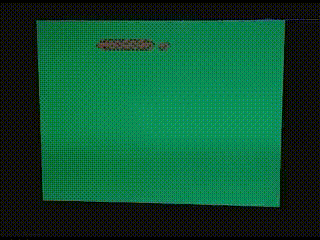
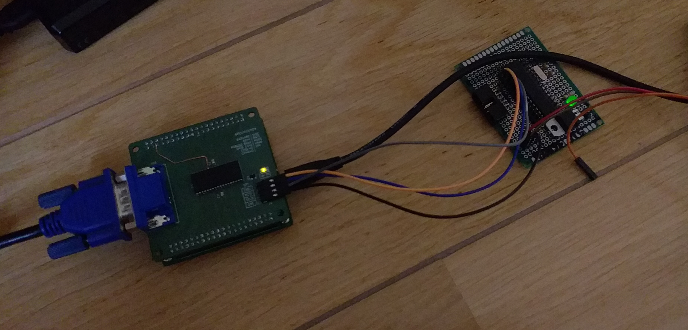

# Snake on custom hardware
## Custom VGA video card + ATmega88 driver

(slowed down by 64 times)

## Components

- VGA video card ([GitHub project](https://github.com/szym-mie/vga3))
- Any ATmega88 board

## Building

Run `make all` to build the project, then `(sudo) make upload` to send it to the device with `avrdude`.
